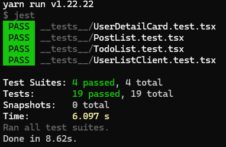
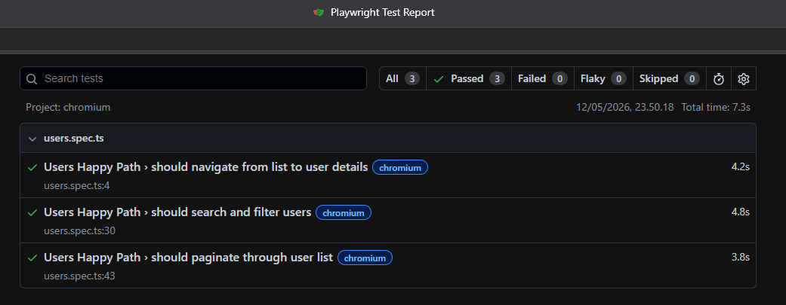

<div align="center">

# 🚀 Workstack Ops
**A premium User Operations Workspace for modern development teams.**

[](https://workstack-mampu.vercel.app/)
[](https://opensource.org/licenses/MIT)

<p align="center">
  
</p>

---

<p align="center">
  <b>Built with the modern stack for PT Mampu Inovasi Digital.</b><br>
  Focusing on clean architecture, tactile UX, and a robust testing suite.
</p>

</div>

A premium, high-performance User Operations Dashboard built with **Next.js 15**, **TypeScript**, and **Tailwind CSS**. This project was developed as a technical home test for **PT Mampu Inovasi Digital**, focusing on clean architecture, advanced UX interactions, and a comprehensive testing suite.

## 🌟 Key Features

### 1. User Directory (Task 2 & 4)
- **Activity Signals:** Each user row is enriched with real-time derived data: total posts, completed todos, and pending todos.
- **Advanced Filtering:** Beyond basic search, implement filters for "Users with Pending Tasks" and "Users with No Completed Tasks".
- **Dynamic Sorting:** Sort users by Name, Most Pending Todos, or Total Posts.
- **Smooth Debounced Search:** Performance-optimized client-side search with loading indicators, quick clear actions, and keyboard shortcuts (`/` to focus).
- **Premium Pagination:** Custom tactile pagination system with active states, scale animations, and accessibility labels.

### 2. User Detail Workspace (Task 3 & 4)
- **Comprehensive Profile:** Clean presentation of Contact, Address, and Company information in a modern card layout.
- **Activity Breakdown:** Dedicated sections for User Posts and Todos with tabbed navigation and "Show More" expansion logic to maintain visual hierarchy.
- **Clickable Rows:** Table rows use the **Stretched Link** pattern for intuitive navigation while maintaining semantic HTML accessibility.
- **SEO Ready:** Dynamic metadata generation using Next.js `generateMetadata`.

### 3. State-of-the-Art UX (Task 5)
- **Adaptive Layout:** Seamless transition from a robust **Table on Desktop** to specialized **Action Cards on Mobile**.
- **Pastel Design System:** A curated light-mode only pastel theme (Indigo/Slate) providing a clean, professional, and accessible interface.
- **Tactile Interactions:** Micro-animations (e.g., `active:scale-95`, smooth transitions) on buttons and interactive elements for a premium feel.
- **Graceful Error Handling:** Custom Skeletons, Error Boundaries, and interactive Empty States with "Reset Filters" support.

## 🛠️ Tech Stack

- **Framework:** Next.js 15 (App Router) + TypeScript
- **State Management:** TanStack Query (React Query) for optimized data fetching and synchronization.
- **Styling:** Tailwind CSS + Vanilla CSS (Custom Pastel Design System).
- **Icons:** Solar Icons via Iconify (Premium SVG Icon set).
- **Testing:** 
  - **Unit:** Jest + React Testing Library (19+ tests covering activity signals and business logic).
  - **E2E:** Playwright (Happy path scenarios: List → Search → Paginate → Details).

## 📸 Proof of Testing

> [!NOTE]
> To view the actual images, please run the tests and save the screenshots in `docs/screenshots/`.

### Unit Testing (Jest)


*19 tests passed covering all user operations, activity signals, and filtering logic.*

### E2E Testing (Playwright)


*E2E scenarios verified: navigation flow, search debounce performance, and pagination stability.*

## 📦 Getting Started

1. **Clone & Install:**
   ```bash
   git clone <repo-url>
   cd workstack
   yarn install
   ```

2. **Setup Playwright Browsers:**
   ```bash
   yarn playwright install chromium
   ```

3. **Run Development Server:**
   ```bash
   yarn dev
   ```

## 🧪 Running Tests

### Unit Tests
```bash
yarn test
```

### E2E Tests
```bash
# Headless mode
yarn test:e2e

# UI Mode (Interactive)
yarn test:e2e:ui
```

## 📝 Task Compliance Checklist

- [x] **Task 1: Setup** - Next.js 13+ (App Router), TS, Tailwind, Jest+RTL.
- [x] **Task 2: Users List** - Responsive Table, Search, Sort, Loading/Error states.
- [x] **Task 3: User Details** - Clickable rows, Detailed Card, Address/Company info, Back Link, SEO.
- [x] **Task 4: User Operations** - Derived Activity Signals, Mobile Cards, Advanced Filters, Persisted State.
- [x] **Task 5: Styling & UX** - Modern UI, Skeletons, Accessible Semantics, Empty States.
- [x] **Bonus Items** - Pagination, Playwright E2E, ISR, Error Boundaries.

---
Developed with ❤️ for **PT Mampu Inovasi Digital**.
